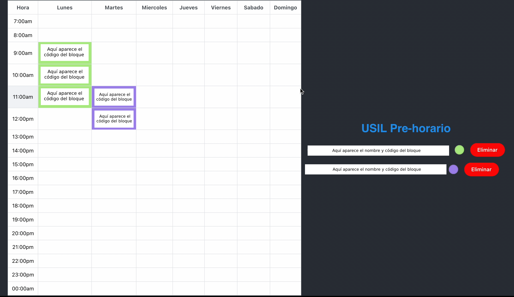

This project was bootstrapped with [Create React App](https://github.com/facebook/create-react-app).

<p align="center">
  
</p>

# USIL Pre-Horario Extension
<p align="center">
  
</p>

---
Extensión de Chrome que permite generar un pre-horario con cursos seleccionados por el usuario, al momento de que el puedas matricularte (sin importar la prioridad de matrícula).

  ### Funcionalidades actuales:
  - Agregar y eliminar cursos
  - Vista de cursos y bloques desde la extensión
  - Vista de horario completo en página adicional de la extensión
  - Advertencia de cruce de cursos

  ### ¿Cómo usarla?

  Para poder usar la extensión, sigue los pasos a continuación:
  1. En el tab "Agregar", Copia el código del bloque completo(tal como aparece en la ventana emergente de bloques)
  2. Procede a buscarlo. Si el bloque presenta cruce o el curso ya está registrado, obtendrás un error; de lo contrario, se agregará automáticamente
  3. En el tab "Ver cursos", podrás ver tus cursos registrados y acceder a tu horario creado
  4. Podrás visualizar todos tus cursos agregados en la pantalla de horario
  <p align="center">
    
    
    
    
  </p>

## Contribuir
Este proyecto fue creado con [Create React App](https://github.com/facebook/create-react-app).

  ### Requisitos

  - Node.js (versión recomendada: 14.0.0 o superior)
  - npm (versión recomendada: 6.14.0 o superior)

  ### Instalación

  1. Clonar el repositorio en tu ordenador:
  ```
  git clone 
  ```
  2. Abrir una terminal en la carpeta del proyecto:
  ```
  cd PreScheduleUSIL-extension 
  ```
  3. Instalar las dependencias:
  ```
  npm install 
  ```
  ### Uso

  1. Iniciar la aplicación en modo de desarrollo:
  ```
  npm start 
  ```
  2. Abrir [http://localhost:3000](http://localhost:3000) en tu navegador web para ver la aplicación en funcionamiento.

  3. Realizar cambios en el código fuente y guardarlos. La aplicación se actualizará automáticamente con los cambios.

  4. Para construir la aplicación para producción:
  ```
  npm run build 
  ```
  5. La versión optimizada para producción estará disponible en la carpeta `build/`.

  Si deseas contribuir a este proyecto, por favor sigue los siguientes pasos:

  1. Crea un fork del proyecto.
  2. Realiza tus cambios en una rama separada.
  3. Envía un pull request a la rama principal del proyecto.